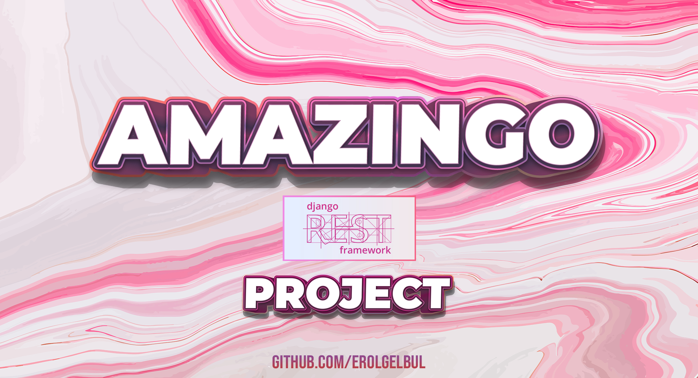
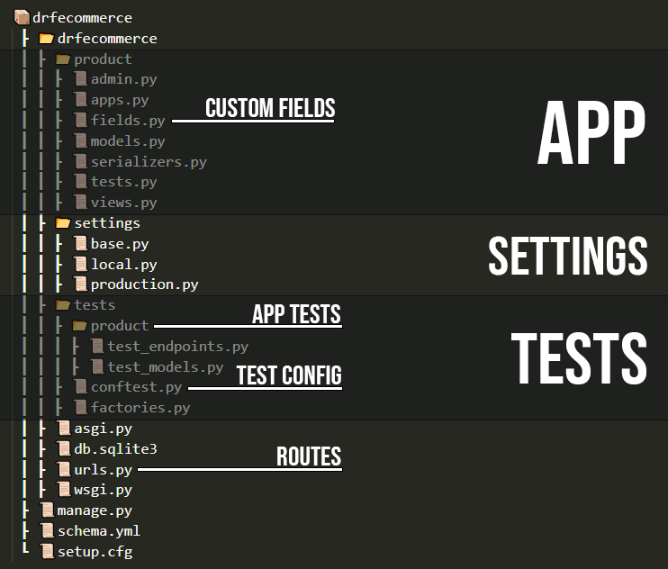
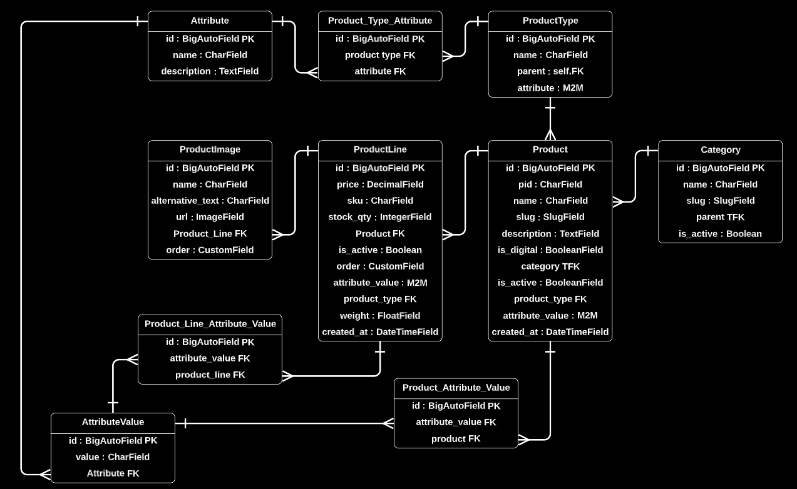
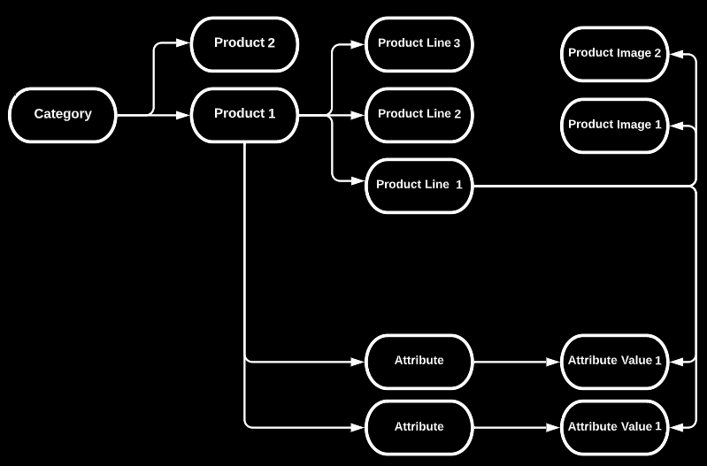
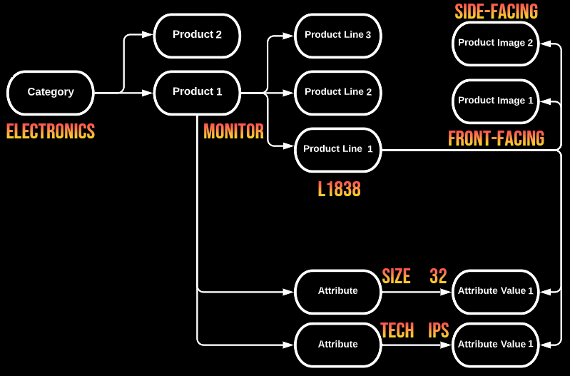
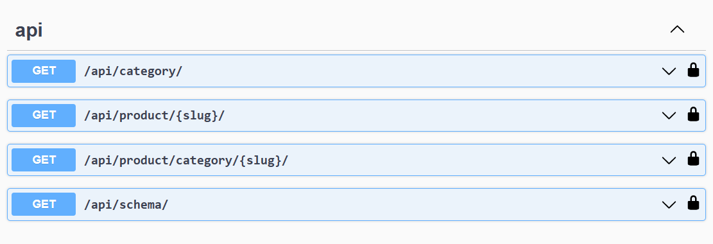

<div id="top"></div>

<div style="text-align:center"></div>

## 1. Introduction

### 1.1 Overview

Welcome to my ecommerce API built using Django and Django REST Framework. The
API provides endpoints for creating, reading, updating, and deleting data
related to products, product lines, categories, attribute values, product types,
and attributes.

---

### 1.2 Specification

#### 1.2.1 User Requirements

Return a single product and associated product lines
Return a list of all products
Return a list of products by category
Return a list of products by product attribute
Return a list of new products
Sort a list of products by price

#### 1.2.2 Low Priority
Add a review for a product
Return a list of products on promotion

#### 1.2.3 Business Requirements
Add, Update or Delete new products
Add, Return or Update details related to product stock levels
Report: Return a list of total products sold per product
Report: Return a list of newly added products for a given timeframe
Report: Return a list of low or not-in-stock products
Sort a list of products by date
Return the name of the user who entered the product into the database
When was the product added to the database?

#### 1.2.4 System Requirements
Return product data and images
Return a single product and associated sub-product

---

#### 1.2.5 User Story

| Overview | |
| :--- | --- |
| **Title** | Customer Product Browsing Behaviour |
| **Description** | Identifying a basic customer behavioural interaction when browsing products |
| **Actors and Interfaces** | Customer / Web User |
| **Initial Status and Preconditions** | Assumption that customer enters from the root/homepage |
| **Basic Flow**| Step1: Land on the homepage<br>Step2: Select a product category <br>Step3: Browse, select, and view individual products related to the selected category<br>Step4: Select and view individual product-line details |
| **Alternate Flows** | - Customers may prefer searching for the product using keyword search features<br>- Customers may navigate to a product from an internal promotional panel

## 2. Getting Started

### 2.1 Tech Stack

<ins>Back-end frameworks</ins>: Django, Django REST Framework

<ins>RDBMS</ins>: SQLite

<ins>Testing Framework</ins>: pytest

---

### 2.2 Installation

#### 2.2.1 Install Python

<ins>Windows</ins> 

1. Go to the official Python website:
[Python](https://www.python.org/downloads/windows/)
2. Download the latest version of Python for Windows by clicking on the
   "Download Python" button. Choose the version that is appropriate for your
   system (32-bit or 64-bit).
3. Open the downloaded installer and follow the installation wizard. Make sure
   to select the option "Add Python to PATH" during the installation process.

<ins>MacOS</ins> 

1. Go to the official Python website:
[Python](https://www.python.org/downloads/windows/)
2. Download the latest version of Python for Windows by clicking on the
   "Download Python" button. Choose the version that is appropriate for your
   system (32-bit or 64-bit).
3. Open the downloaded installer and follow the installation wizard. Make sure
   to select the option "Install for all users" and "Add Python to PATH" during
   the installation process.

<ins>Linux</ins> 

1. Open a terminal window.
2. Use the package manager for your Linux distribution to install Python. For
   example, on Ubuntu and Debian, you can use the command `sudo apt-get install
   python3` to install Python 3.
3. Verify that Python is installed by running the command `python3 --version` in
   the terminal. If Python is installed correctly, you should see the version
   number of Python that you installed.


#### 2.2.2 Install & Activate Virtual Environment

Depending on how you want to use this project, you may want to run it locally on
your machine. If so follow the steps on this section:

1. Install virtualenv: Once you have installed Python, you can install virtualenv using pip. Open your
terminal (Command Prompt for Windows) and type:
```bash
pip install virtualenv
```

<ins>MacOS & Linux</ins>

2. Create a virtual environment: To create a virtual environment, go to the
directory where you want to create it and run the following command:

```bash
virtualenv myenv
```
Here, myenv is the name of the virtual environment. You can choose any name you
want.

3. Activate the virtual environment: To activate the virtual environment,
run the following command:

```bash
source myenv/bin/activate
```

<ins>Windows</ins>

On Windows, the command is slightly different:

```bash
myenv\Scripts\activate.bat
```


#### 2.2.3 Install Requirements

1. Open the command prompt
2. Navigate to the directory that contains the requirements.txt file.
3. Run the following command:


```bash
pip install -r requirements.txt
```


## 2.2.4 Run on Local Server

Run inside the directory containing `manage.py` file:

```bash
python manage.py runserver
```

## 2.2.5 Run the migrations

Prepare:

```bash
python manage.py makemigrations
```

Run:

```bash
python manage.py migrate
```


## 3. Structure & Design

### 3.1 Folder Structure

<div style="text-align:center"></div>


### 3.2 Database Design

<div style="text-align:center"></div>

### 3.3 Design Outline w/ Records

<div style="text-align:center"></div>

Specific example, how the records might appear on the database.

<div style="text-align:center"></div>

<p align="right">(<a href="#top">back to top</a>)</p>

## 4. Models

### 4.1 IsActiveQueryset Custom Manager

defines a single method is_active that returns a filtered queryset containing
only the active categories (those with is_active=True).

By using as_manager() on the IsActiveQueryset class and assigning it to the
objects attribute of the Category model, we are creating a custom manager named
objects that can be used to query the Category model with the is_active()
method.

In other words, by using the custom manager in our queries, we can easily filter
and retrieve only active categories without having to write the filter
expression each time. In the next model, we can do Category.objects.is_active()
instead of Category.objects.filter(is_active=True).

This approach promotes code reuse and improves code readability, making it
easier to maintain and extend the codebase in the future.

### 4.2 Category Model

| Field | Parameters | Type |
| --- | --- | --- |
| name | `max_length=235, unique=True` | CharField |
| slug | `max_length=255, unique=True` | SlugField |
| is_active | `default=False` | BooleanField |
| parent | `on_delete=models.PROTECT, null=True, blank=True` | TreeForeignKey to `self` model |


### 4.3. Product Model

| Field | Parameters | Type |
| --- | --- | --- |
| name | `max_length=100` | CharField |
| slug | `max_length=255` | SlugField |
| pid | `max_length=10, unique=True` | CharField |
| description | `blank=True` | TextField |
| is_digital | `default=False` | BooleanField |
| category | `on_delete=models.PROTECT` | TreeForeignKey to `Category` model |
| product_type | `on_delete=models.PROTECT, related_name="product_type"` | ForeignKey to `ProductType` model |
| is_active | `default=False` | BooleanField |
| created_at | `auto_now_add=True, editable=False` | DateTimeField |
| attribute_value | `through="ProductAttributeValue", related_name="product_attr_value"` | ManyToManyField to `AttributeValue` model |

> Note: Purpose of BooleanField `is_active`:

- Product may be seasonal.
- Product may be incomplete and until the docs/images/stock is ready, the
  product might have to stay offline.

> Tip:
Don't utilise primary key since it indicates how many products we have, auto incrementing, if someone scrapes our website, they can grab all the data.


### 4.4 Attribute Model

| Field | Parameters | Type |
| --- | --- | --- |
| name | `max_length=100` | CharField |
| description | `blank=True` | TextField |


### 4.5 AttributeValue Model

| Field | Parameters | Type |
| --- | --- | --- |
| attribute_value | `max_length=100` | CharField |
| attribute | `on_delete=models.CASCADE, related_name="attribute_value"` | ForeignKey to `Attribute` model |

### 4.6 ProductAttributeValue Model

| Field | Parameters | Type |
| --- | --- | --- |
| attribute_value | `on_delete=models.CASCADE, related_name="product_value_av"` | ForeignKey to `AttributeValue` model |
| product | `on_delete=models.CASCADE, related_name="producte_value_pl"` | ForeignKey to `Product` model |

### 4.7 ProductLineAttributeValue Model

| Field | Parameters | Type |
| --- | --- | --- |
| attribute_value | `on_delete=models.CASCADE, related_name="product_attribute_value_av"` | ForeignKey to `AttributeValue` model |
| product_line | `on_delete=models.CASCADE, related_name="product_attribute_value_pl"` | ForeignKey to `ProductLine` model |


### 4.7 ProductLine Model

| Field | Parameters | Type |
| --- | --- | --- |
| price | `decimal_places=2, max_digits=5` | DecimalField |
| sku | `max_length=10` | CharField |
| stock_qty | | IntegerField |
| product | `on_delete=models.PROTECT, related_name="product_line"` | ForeignKey to `Product` model |
| is_active | `default=False` | BooleanField |
| order | `unique_for_field="product", blank=True` | OrderField |
| weight | | FloatField |
| attribute_value | `through="ProductLineAttributeValue", related_name="product_line_attribute_value"` | ManyToManyField to `AttributeValue` model |
| product_type | `on_delete=models.PROTECT, related_name="product_line_type"` | ForeignKey to `ProductType` model |
| created_at | `auto_now_add=True, editable=False` | DateTimeField |

### 4.8 ProductImage Model

| Field | Parameters | Type |
| --- | --- | --- |
| alternative_text | `max_length=100` | CharField |
| url | `upload_to=None, default="test.jpg"` | ImageField |
| product_line | `on_delete=models.CASCADE, related_name="product_image"` | ForeignKey to `ProductLine` model |
| order | `unique_for_field="product_line", blank=True` | OrderField |


### 4.9 ProductType Model

| Field | Parameters | Type |
| --- | --- | --- |
| name | `max_length=100` | CharField |
| parent | `on_delete=models.PROTECT, null=True, blank=True` | ForeignKey to `self` model |
| attribute | `through="ProductTypeAttribute", related_name="product_type_attribute"` | ManyToManyField to `Attribute` model |

### 4.10 ProductTypeAttribute Model

| Field | Parameters | Type |
| --- | --- | --- |
| product_type | `on_delete=models.CASCADE, related_name="product_type_attribute_pt"` | ForeignKey to `ProductType` model |
| attribute | `on_delete=models.CASCADE, related_name="product_type_attribute_a"` | ForeignKey to `Attribute` model |

<p align="right">(<a href="#top">back to top</a>)</p>

## 5. API Endpoints

<div style="text-align:center"></div>

Go to:

```bash
http://127.0.0.1:8000/api/schema/docs/
```

<p align="right">(<a href="#top">back to top</a>)</p>

## 6. Testing

### 6.1 Model Testing

#### 6.1.1 Category Model:

### test_str_output:
checks if the __str__() method of the Category model is implemented correctly
and returns the category name as its string representation.

### test_name_max_length:
checks if the Category model properly enforces
the maximum length constraint for the name field and raises a ValidationError
when the constraint is violated.

> Note: previous tests do not test Django, they test the implementation of the developer.

### test_slug_max_length:
checks if the Category model properly enforces
the maximum length constraint for the slug field and raises a ValidationError
when the constraint is violated.

### test_name_unique_field:
checks if the Category model properly
enforces the uniqueness constraint for the name field and raises an
IntegrityError when a duplicate name is attempted to be saved.

### test_slug_unique_field:
checks if the Category model properly
enforces the uniqueness constraint for the slug field and raises an
IntegrityError when a duplicate name is attempted to be saved.

### test_is_active_false_default:
checks if the Category model correctly sets the default value of the is_active field to False when creating new instances.

### test_parent_category_on_delete_protect:
checks if the Category model correctly enforces the PROTECT constraint on the parent field, preventing the deletion of a parent category when it still has child categories associated with it.

### test_parent_field_null:
checks if the Category model allows the parent field to be None by default when creating a new Category instance. It ensures that a category without a specified parent is created with a parent value of None.

### test_return_category_active_only_true:
checks if the Category model's
manager method is_active() returns only the active categories. It ensures that
when calling Category.objects.is_active(), only categories with is_active set to
True are included in the queryset.

### test_return_category_active_only_false:
checks if the Category model's
manager method is_active() returns only the active categories. It ensures that
when calling Category.objects.is_active(), only categories with is_active set to
False are included in the queryset.

---

#### 6.1.2 Product Model:

### test_str_method: 
verifies that the __str__() method of the Product
model is implemented correctly and returns the product name as its string
representation.

### test_fk_product_type_on_delete_protect:
verifies that the Product
model correctly enforces the PROTECT constraint on the product_type field,
preventing the deletion of a ProductType when it still has associated Product
instances.

### test_name_max_length:
checks if the Product model properly enforces
the maximum length constraint for the name field and raises a ValidationError
when the constraint is violated.

### test_slug_max_length:
checks if the Product model properly enforces
the maximum length constraint for the slug field and raises a ValidationError
when the constraint is violated.

### test_pid_length:
checks if the Product model properly enforces
the maximum length constraint for the pid field and raises a ValidationError
when the constraint is violated.

### test_is_digital_false_default:
verifies that the Product model correctly stores the value of the is_digital field when it's set to False during the creation of a new instance.

### test_fk_category_on_delete_protect:
verifies that the Product model correctly enforces the PROTECT constraint on the category field, preventing the deletion of a Category when it still has associated Product instances.

### test_return_product_activate_only_true:
verifies that the Product model's is_active() method correctly filters and returns only active products in the queryset.

### test_return_product_activate_only_false:
verifies that the Product model's is_active() method correctly filters and returns only active products in the queryset.

---

#### 6.1.3 ProductLine Model:

### test_duplicate_attribute_inserts:
checks if the ProductLine model
enforces the uniqueness constraint for the combination of its ForeignKey fields
attribute_value and product_line. It ensures that a ValidationError is raised
when trying to create a ProductLineAttributeValue instance with the same
attribute and product_line values as an existing ProductLineAttributeValue.

In summary, this test verifies that the ProductLine model correctly enforces the
uniqueness constraint for the combination of attribute_value and product_line
fields, preventing the creation of duplicate ProductLineAttributeValue instances
with the same attribute and product_line.

### test_str_method:
verifies that the __str__() method of the
ProductLine model is implemented correctly and returns the SKU value as its
string representation.

### test_fk_product_type_on_delete_protect:
verifies that the ProductLine
model correctly enforces the PROTECT constraint on the product_type field,
preventing the deletion of a ProductType when it still has associated
ProductLine instances.

### test_field_decimal_places:
checks if the ProductLine model properly
enforces the decimal places constraint for the price field and raises a
ValidationError when the constraint is violated.


### test_field_price_max_digits:
checks if the ProductLine model properly
enforces the maximum digits constraint for the price field and raises a
ValidationError when the constraint is violated.

---

#### 6.1.4 ProductImage Model:

### test_str_method:
verifies that the __str__() method of the
ProductImage model is implemented correctly and returns a string representation
that combines the related ProductLine's SKU value and the "_img" suffix.

### test_alternative_text_field_length:
checks if the ProductImage model
properly enforces the maximum length constraint for the alternative_text field
and raises a ValidationError when the constraint is violated.

### test_duplicate_order_values:
verifies that the ProductImage model
correctly enforces the uniqueness constraint for the combination of order and
product_line fields, preventing the creation of duplicate ProductImage instances
with the same order and product_line.

---

#### 6.1.5 ProductType Model:

### test_str_method:
verifies that the __str__() method of the ProductType model is
implemented correctly and returns the product type name as its string
representation.

### test_name_field_max_length:
checks if the ProductType model properly
enforces the maximum length constraint for the name field and raises a
ValidationError when the constraint is violated.

---

#### 6.1.6 Attribute Model:

### test_str_method:
verifies that the __str__() method of the Attribute
model is implemented correctly and returns the attribute name as its string
representation.

### test_name_field_max_length:
checks if the Attribute model properly
enforces the maximum length constraint for the name field and raises a
ValidationError when the constraint is violated.

---

#### 6.1.7 AttributeValue Model:

### test_str_method:
verifies that the __str__() method of the
AttributeValue model is implemented correctly and returns a string
representation that combines the related Attribute's name and the
attribute_value value.

### test_value_field_max_length:
checks if the AttributeValue model
properly enforces the maximum length constraint for the attribute_value field
and raises a ValidationError when the constraint is violated.


<p align="right">(<a href="#top">back to top</a>)</p>

### 6.2 Endpoint Testing

#### 6.2.1 Category Endpoint:

### test_category_get:
tests the HTTP GET method for the category endpoint. It creates four categories
using a fixture called "category_factory" and sends a GET request to the
endpoint using an "api_client" fixture.

The test method then checks that the response status code is 200 (success) and
that the length of the JSON content in the response is 4, which ensures that the
endpoint returns the correct number of categories.


#### 6.2.2 Product Endpoint:

### test_return_single_product_by_slug

uses a "product_factory" fixture to create a product with a specific slug and
then sends a GET request to the product endpoint with the product's slug as part
of the URL. The test asserts that the response status code is 200 and that the
length of the JSON content in the response is 1, which means that the endpoint
returns a single product.

### test_return_products_by_category_slug

uses fixtures called "category_factory" and "product_factory" to create a
category and a product that belongs to that category. It then sends a GET
request to the product endpoint with the category's slug as part of the URL. The
test asserts that the response status code is 200 and that the length of the
JSON content in the response is 1, which means that the endpoint returns a
single product that belongs to the specified category.

<p align="right">(<a href="#top">back to top</a>)</p>

### 6.3 Notes on Tests

.clean() method inside the `ProductLine` model only applies within forms. When
the developer tries to add a record from the terminal or by other means, the
the method will not be applied. Hence, during testing,
`test_duplicate_order_values`, the `clean` method is added at the end.

```python
def test_duplicate_order_values(self, product_line_factory, product_factory):
    x = product_factory()
    product_line_factory(order=1, product=x)
    with pytest.raises(ValidationError):
        product_line_factory(order=1, product=x).clean()
```

You may counteract this by applying the `full_clean` method inside the `save`
method, as shown here:

```python
def save(self, *args, **kwargs):
    self.full_clean()
    return super(ProductLine, self).save(*args, **kwargs)
```

Now, the `clean` method is not required during the test:

```python
def test_duplicate_order_values(self, product_line_factory, product_factory):
    x = product_factory()
    product_line_factory(order=1, product=x)
    with pytest.raises(ValidationError):
        product_line_factory(order=1, product=x)
```

## 7. SQL Performance

```python
class ProductViewSet(viewsets.ViewSet):
    """A simple Viewset for viewing all products"""

    queryset = Product.objects.all()
    lookup_field = "slug"

    def retrieve(self, request, slug=None):
        serializer = ProductSerializer(self.queryset.filter(slug=slug), many=True)

        # Insepection start:
        x = self.queryset.filter(slug=slug)
        sqlformatted = format(str(x.query), reindent=True)
        print(highlight(sqlformatted, SqlLexer(), TerminalFormatter()))
        # Inspection end.

        return Response(serializer.data)
```

```bash
SELECT "product_product"."id",
       "product_product"."name",
       "product_product"."slug",
       "product_product"."description",     
       "product_product"."is_digital",      
       "product_product"."brand_id",        
       "product_product"."category_id",     
       "product_product"."is_active"        
FROM "product_product"
WHERE "product_product"."slug" = p1
```


How many queries for this operation?

```python
class ProductViewSet(viewsets.ViewSet):
    """A simple Viewset for viewing all products"""

    queryset = Product.objects.all()
    lookup_field = "slug"

    def retrieve(self, request, slug=None):
        serializer = ProductSerializer(self.queryset.filter(slug=slug), many=True)

        data = Response(serializer.data)

        q = list(connection.queries)
        print(len(q))
```

```bash
[10/Jan/2022 04:19:22] "GET /api/schema/ HTTP/1.1" 200 14844
4
```


List all the queries:


```bash
SELECT "product_product"."id",
       "product_product"."name",
       "product_product"."slug",
       "product_product"."description",     
       "product_product"."is_digital",      
       "product_product"."brand_id",        
       "product_product"."category_id",     
       "product_product"."is_active"        
FROM "product_product"
WHERE "product_product"."slug" = 'p2'       
___
SELECT "product_brand"."id",
       "product_brand"."name"
FROM "product_brand"
WHERE "product_brand"."id" = 1
LIMIT 21
___
SELECT "product_category"."id",
       "product_category"."name",
       "product_category"."parent_id",      
       "product_category"."lft",
       "product_category"."rght",
       "product_category"."tree_id",        
       "product_category"."level"
FROM "product_category"
WHERE "product_category"."id" = 1
LIMIT 21
___
SELECT "product_productline"."id",
       "product_productline"."price",       
       "product_productline"."sku",
       "product_productline"."stock_qty",   
       "product_productline"."product_id",  
       "product_productline"."is_active"    
FROM "product_productline"
WHERE "product_productline"."product_id" = 2
```

That's too much for a simple LEFT (OUTER) JOIN. Let's add `select_related`
method to specify the product's category while querying.

```python
def retrieve(self, request, slug=None):
    serializer = ProductSerializer(
        self.queryset.filter(slug=slug).select_related("category"), many=True
    )
```

Now we can see that JOIN inside our queries:

```bash
SELECT "product_product"."id",
       "product_product"."name",
       "product_product"."slug",
       "product_product"."description",     
       "product_product"."is_digital",      
       "product_product"."brand_id",        
       "product_product"."category_id",     
       "product_product"."is_active",       
       "product_category"."id",
       "product_category"."name",
       "product_category"."parent_id",      
       "product_category"."lft",
       "product_category"."rght",
       "product_category"."tree_id",        
       "product_category"."level"
FROM "product_product"
LEFT OUTER JOIN "product_category" ON ("product_product"."category_id" = "product_category"."id")
WHERE "product_product"."slug" = 'p1'  
```

Using the second Foreign Key (brand) reduces another layer of query.

```python
def retrieve(self, request, slug=None):
    serializer = ProductSerializer(
        self.queryset.filter(slug=slug).select_related("category", "brand"),
        many=True,
    )
```

Now the number of queries are reduced to:

```bash
[10/Jan/2022 04:35:49] "GET /api/schema/ HTTP/1.1" 200 14844
2
```

Analysing the querysets within our views may be cumbersome. I have a specific
middleware for this situation that you can use,
[here](https://github.com/ErolGelbul/orm_2_sql_visualizer).


#### Use Prefetch to reduce the number of queries:


```python
class ProductViewSet(viewsets.ViewSet):
    """A simple Viewset for viewing all products"""

    queryset = Product.objects.all().isactive()
    lookup_field = "slug"

    def retrieve(self, request, slug=None):
        serializer = ProductSerializer(
            Product.objects.filter(slug=slug)
            .select_related("category", "brand")
            .prefetch_related(Prefetch("product_line__product_image")),
            many=True,
        )
        return Response(serializer.data)
```

Without prefetch:

```bash
===============================================
                 [SQL Stats]
===============================================
Total queries: 9
Total execution time: 0.0016ms
Duplicate queries: 0
===============================================
```

With prefetch:
```bash
===============================================
                 [SQL Stats]
===============================================
Total queries: 4
Total execution time: 0.0002ms
Duplicate queries: 0
===============================================
```

## 8. Future Work

- Connect the project to a PostgreSQL database.
- Deployment.

<p align="right">(<a href="#top">back to top</a>)</p>

## 9. Contributing

If you would like to add any extra features to the optimisation simulation, feel free to fork and create a pull request. Thank you!

1. Fork the Project
2. Create your Feature Branch (`git checkout -b feature/AmazingFeature`)
3. Commit your Changes (`git commit -m 'Add some AmazingFeature'`)
4. Push to the Branch (`git push origin feature/AmazingFeature`)
5. Open a Pull Request

<p align="right">(<a href="#top">back to top</a>)</p>


<!-- CONTACT -->
## 10. Contact

Erol Gelbul - [Website](http://www.erolgelbul.com)

Project Link: [Amazingo](https://github.com/ErolGelbul/amazingo)

<p align="right">(<a href="#top">back to top</a>)</p>
